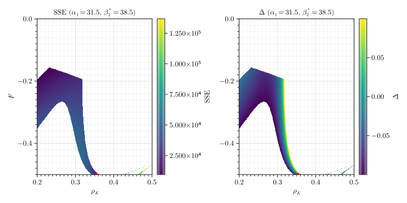

# Turbothesis

[Документы](https://github.com/ArtemChandragupta/Turbothesis) написаны с помощью системы компьютерной вёрстки [typst](https://typst.app/) в редакторе [helix](https://helix-editor.com/). Расчеты проводились инструментами языка [Julia](https://julialang.org/) в среде [Pluto](https://plutojl.org/), для построения графиков использован пакет [Makie.jl](https://docs.makie.org/stable/).

