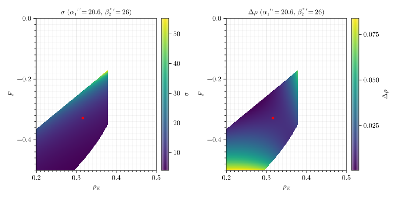

# Turbothesis

[Документы](https://github.com/ArtemChandragupta/Turbothesis) написаны с помощью системы компьютерной вёрстки [typst](https://typst.app/) в редакторе [helix](https://helix-editor.com/). Расчеты проводились инструментами языка [Julia](https://julialang.org/) в среде [Pluto](https://plutojl.org/), для построения графиков использованы пакеты [Makie.jl](https://docs.makie.org/stable/) и [lilaq](https://lilaq.org/). Для обработки результатов A2GTP использовалась оболочка [nushell](https://www.nushell.sh/).

Для построения 3D-модели лопатки исползован [waterfall-cad](https://hackage.haskell.org/package/waterfall-cad).

Расчет обтекания и прочности проводился в [Ansys-2022](https://www.ansys.com/) с помощью модулей CFX и mechanical.

